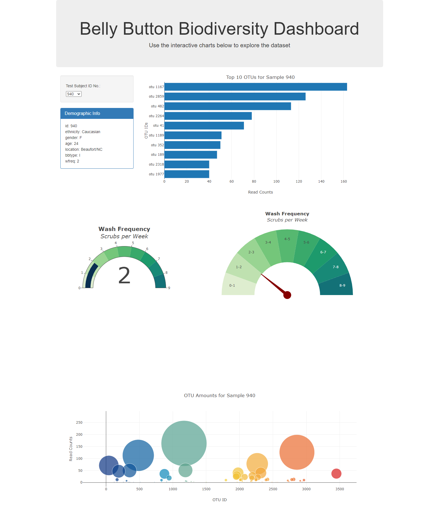

# plotly-challenge
This assignment consisted of using JavaScript, json, and html to build an interactive dashboard.

# What the code does (in general terms)
The code uses json information on Belly Button Biodiversity from [The Public Science Lab](http://robdunnlab.com/projects/belly-button-biodiversity/).

# What the code displays

The **app.js** code uses d3, plot.ly, and **samples.json** to create 4 graphs, a list of sample information, and a drop-down list that allows users to choose between samples. The information is displayed in the following:
    
    1. A demographic information list containing the id, ethnicity, gender, age, location, belly button type (innie vs outie), and wash frequency for the contributor of each sample.

    2. A horizontal bar chart that displays the sample values of the top ten (10) operational taxonomic units (OTUs) found in the sample.

    3. Two gauge charts visually displaying the belly button wash frequency reported by the sample contributor. The first uses the challenge instructions to format and display (using type: 'indicator'), and the second more closely resembles the example gauge in the pictures included with the challenge instructions (using type: 'pie').

    4. A bubble chart that displays the sample values of all of the OTUs.

**index.html**, and Bootstrap 3 are used to create the webpage displaying the graphs and information.

# Notes on creating gauge charts using plot.ly type: "indicator" vs type: "pie"

    1. Indicators do not seem to resize in real-time even when responsive is set to "true". This can result in parts of the chart being cut off when the page size is changed without refreshing the page. They do still auto-size on page open. 

    2. Pie charts that have the vertically lowest segment set to zero (0) opacity in order to look like a gauge still take up as much vertical space as they would otherwise. This results in what looks to the viewer like a large amount of blank space.

    3. Plot.ly shapes added to graphs can be zoomed in on, even if the parent graph can't. This can cause the graph to look "broken". Disabling zoom on the graph resulted in a needle that was no longer centered on the pie chart, but on the bottom right of the plot-area.

    4. The origin for indicators is in the bottom left corner of the graph. The origin for pie charts is in the center of the chart. Drawing gauge needle shapes has to take this into account. 

A screenshot of the dashboard can be seen below:
